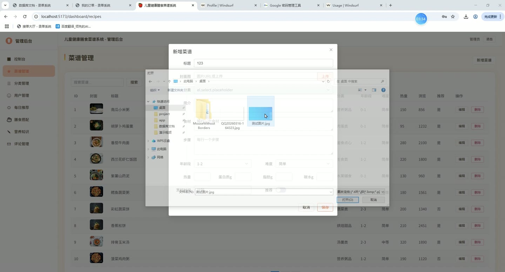
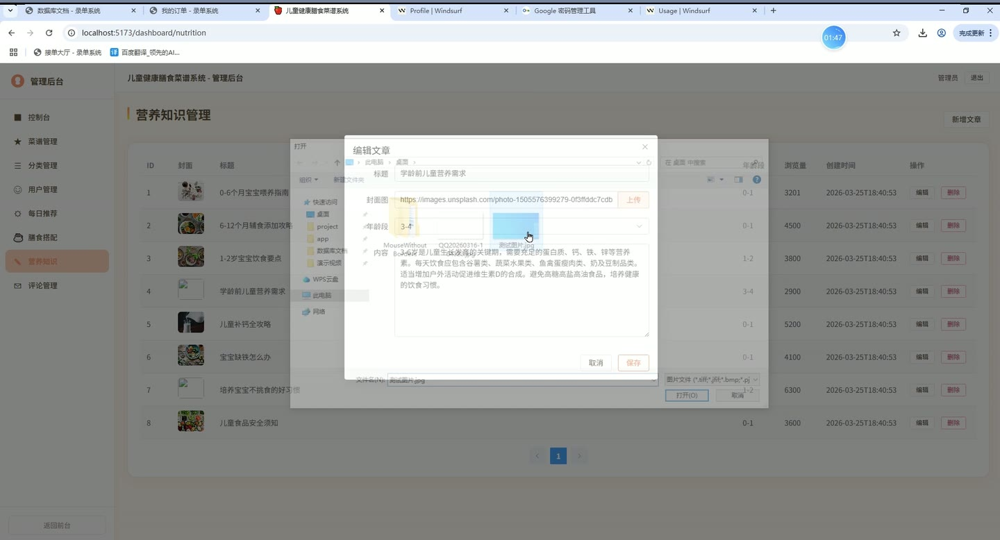
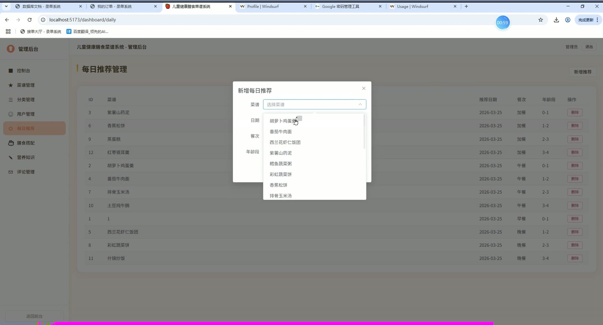
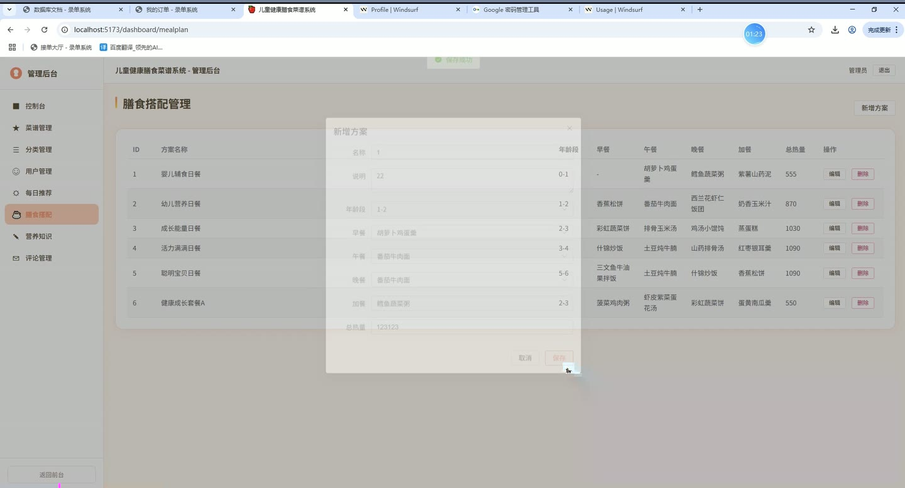

# (附文档)Springboot3+Vue3+MySQL 儿童健康膳食菜谱系统

**技术栈**：Springboot3、Vue3、MySQL

### 系统简介

本系统是一套基于 SpringBoot3 + Vue3 前后端分离的儿童健康膳食菜谱管理平台，面向家长与后台管理员双角色设计。家长可浏览、搜索、收藏菜谱，查看每日推荐与膳食搭配方案，记录宝宝 BMI 并获取饮食建议，学习营养知识；管理员可在后台管理菜谱、分类、用户、每日推荐、膳食搭配方案、营养知识文章及评论。系统内置智能推荐引擎，可根据宝宝年龄自动匹配适合的菜谱。
 
### 核心功能
 
### 普通用户端

 
- 用户注册：填写用户名、密码、昵称、宝宝年龄/身高/体重完成注册，密码 MD5 加密存储 
- 用户登录：输入用户名和密码登录，支持“管理员登录”与“普通用户登录”快捷入口 
- 菜谱浏览：分页查看菜谱列表，支持按关键词、分类、年龄段、难度筛选 
- 菜谱详情：查看菜谱封面、描述、食材清单、烹饪步骤、营养信息（热量/蛋白质/脂肪/碳水）、烹饪时间、难度 
- 菜谱收藏：点击收藏/取消收藏菜谱，在“我的收藏”页面查看已收藏的菜谱列表 
- 菜谱评论：对菜谱发表评论并评分（1-5 分），查看所有评论及评论者昵称/头像 
- 每日推荐：查看当日推荐菜谱，支持按年龄段筛选，推荐按餐次（早餐/午餐/晚餐/加餐）排序 
- 膳食搭配：查看系统预设的膳食搭配方案（含早餐、午餐、晚餐、加餐及总热量），支持按年龄段筛选 
- 营养知识：分页浏览营养知识文章列表，支持关键词搜索，文章按浏览量排序 
- 营养知识详情：查看文章标题、正文、封面图、年龄段标签，访问自动增加浏览量 
- BMI 评估：输入宝宝身高(cm)和体重(kg)，系统自动计算 BMI 并返回偏瘦/正常/偏胖/肥胖状态及饮食建议 
- BMI 历史：查看历次 BMI 评估记录列表，按时间倒序排列 
- 智能推荐：根据当前登录用户的宝宝年龄自动匹配对应年龄段的菜谱，按浏览量推荐前 10 条 
- 个人资料：查看和修改昵称、头像、宝宝年龄/身高/体重、手机号 
- 修改密码：输入原密码和新密码完成密码修改 
- 退出登录：清除会话状态
 
### 管理员端

 
- 控制台概览：展示菜谱总数、用户总数、分类数量、知识文章数量统计卡片 
- 菜谱管理：新增/编辑菜谱（标题、封面、描述、食材、步骤、分类、年龄段、营养数据、烹饪时间、难度、是否推荐），支持删除 
- 分类管理：新增/编辑分类（名称、图标、排序），支持删除 
- 用户管理：分页查看用户列表（用户名/昵称/角色/宝宝信息），支持按关键词搜索和删除用户 
- 每日推荐管理：新增/删除每日推荐记录，可指定菜谱、推荐日期、餐次、年龄段 
- 膳食搭配管理：新增/编辑/删除膳食搭配方案，可设置方案名称、说明、年龄段、早餐/午餐/晚餐/加餐菜谱、总热量 
- 营养知识管理：新增/编辑/删除营养知识文章（标题、内容、封面图、年龄段），支持分页搜索 
- 评论管理：按菜谱筛选查看评论列表（评论内容、评分、用户、时间），支持删除违规评论
 
### 技术栈

 后端框架Spring Boot 3.x ORMMyBatis-Plus（含分页插件、自动填充、逻辑删除） 权限基于 HttpSession 的登录校验，角色字段（USER / ADMIN） 前端框架Vue 3（Composition API + script setup） 状态管理Vue Router（createWebHistory） 构建工具Vite UI 组件库Element Plus 数据库MySQL 密码加密Hutool MD5 工具类 文件上传Spring MultipartFile + 本地文件存储 跨域配置WebMvcConfigurer 全局 CORS 配置
 
### 交付内容

 
- 后端完整源码 
- 前端完整源码 
- 数据库初始化脚本 
- 万字文档

## 界面展示

---

## 获取完整源码 + 万字文档

本仓库为项目介绍页。**完整前后端源码、数据库初始化脚本、万字项目文档**，请加微信 `kangkangcode`，或访问 [codekk.top](http://codekk.top) 获取。

可作课程设计 / 毕业设计参考，支持远程部署调试。